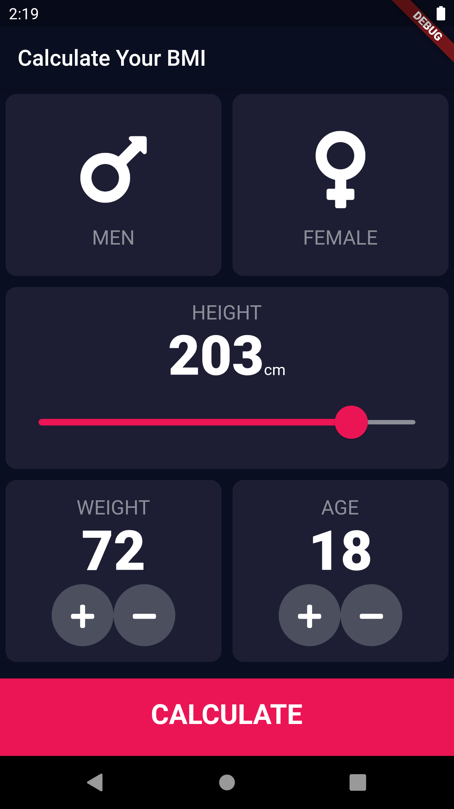

# Body Mass Index Calculator

The App allows to evaluate if a person is at an appropriate weight based on their age, height and weight using [Flutter](https://flutter.dev/).

## How To Use

* Enter your weight and height
* Select "Calculate"

## Screenshots

<table>
    <tr>
        <td></td>     
        <td></td> 
        <td></td> 
    </tr>
</table>

## Credits

Design made by [Ruben Vaalt](https://dribbble.com/shots/4585382-Simple-BMI-Calculator).