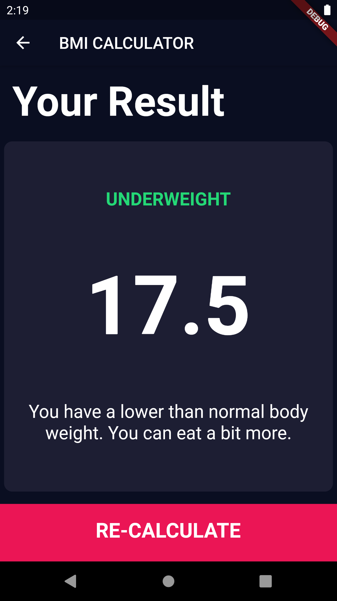

# Body Mass Index Calculator

The App build with Flutter allows to evaluate if a person is at an appropriate weight based on their age, height and weight.

- [Enter your weight and height.]
- [Select "Calculate"]

## Screenshots

<!--  -->

## Credits

Design made by [Ruben Vaalt](https://dribbble.com/shots/4585382-Simple-BMI-Calculator).